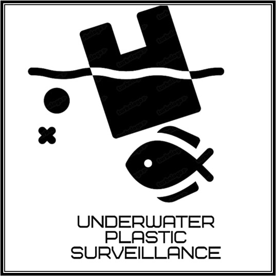

# **Underwater Plastic Detection Using YOLOv9**  

---
*A comprehensive solution for detecting underwater plastic using YOLOv9 and real-time video feeds from an IP webcam.*
---

## **About the Project**  
Underwater plastic waste is a significant environmental issue impacting marine life and ecosystems. This project addresses this problem by leveraging advanced deep learning techniques for real-time detection of underwater plastic. The YOLOv9 model ensures high accuracy and efficiency, making it suitable for diverse underwater conditions.  

### **Key Features**  
- **Real-Time Detection**: Supports live video streaming via IP Webcam.  
- **High Accuracy**: YOLOv9-based model fine-tuned for underwater plastic detection.  
- **Customizable**: Easily modify configurations to adapt to different use cases and environments.  
- **Scalable Solution**: Deployable on various hardware platforms, including edge devices.  

---
You can either upload the images directly for detection through your device or you can do the below stuff for real time detection through your mobile

## **Steps to Set Up the IP Webcam App**  

### **1. Download the App**  
Install the **IP Webcam** app from the Google Play Store on your mobile device.  

### **2. Launch the App**  
- Open the app on your phone and configure the settings.  
- Navigate to **Settings > Video Preferences** and adjust the resolution for optimal performance.  

### **3. Connect to the Same Wi-Fi Network**  
Ensure both your phone and computer are connected to the same Wi-Fi network for proper communication.  

### **4. Start the Stream**  
- Tap on **Start Server** within the IP Webcam app to begin streaming.  
- Note the IP address displayed at the bottom of the app (e.g., `http://192.168.0.101:8080`).  

---

## **Update IP Address in Code**  
Modify the `app.py` file to include the IP address of your IP Webcam stream:  

```python
cap = cv2.VideoCapture("http://192.168.0.101:8080/video")
```
## **Run the Application**  
Run the application using the following command:  

```bash
python app.py
```

---

## **License**  
This project is licensed under the MIT License. See the [LICENSE](LICENSE) file for details.  

---

## **Acknowledgments**  
This project is inspired by ongoing research in marine conservation and deep learning for real-time object detection.  

---

## Future Enhancements

- **Dataset Expansion:**  
  Expand the dataset to include a larger variety of underwater plastic debris images captured under diverse conditions. This will improve the robustness and generalizability of the model.

- **Increased Training Epochs:**  
  Train the model for more epochs to achieve better convergence and optimize performance while addressing overfitting.

- **Object Tracking:**  
  Incorporate object tracking mechanisms to enable better monitoring of detected objects over time.

- **Multi-Class Detection:**  
  Extend the system to detect and classify multiple types of marine debris beyond plastics.

- **Edge Device Optimization:**  
  Improve the system's performance for deployment on low-power edge devices, ensuring efficient real-time processing.


